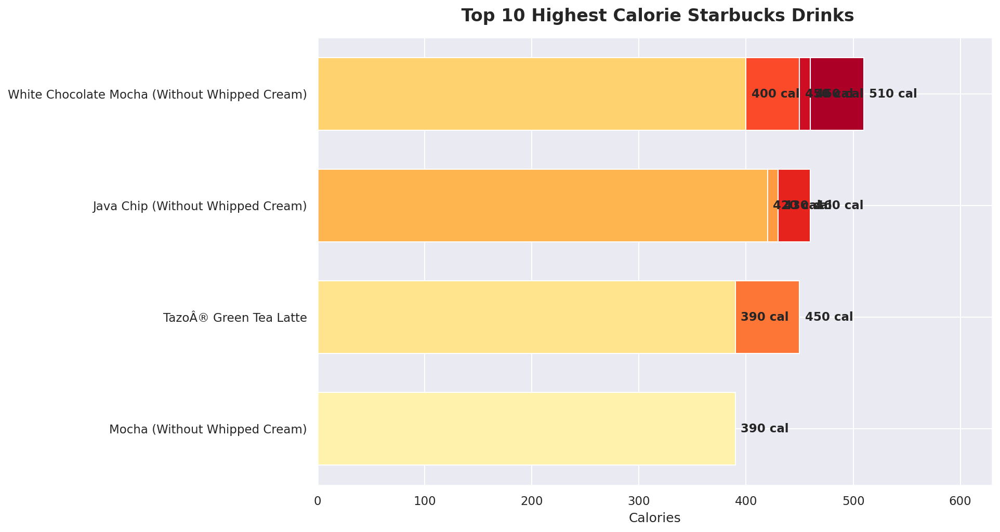
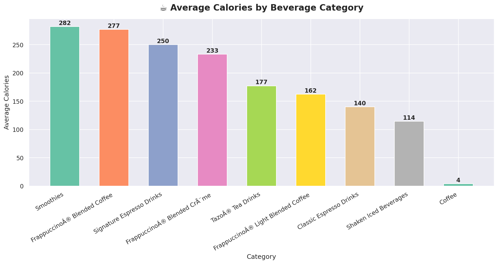
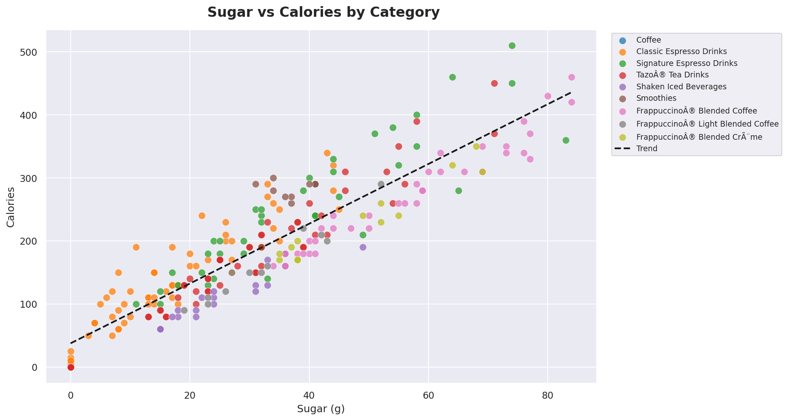
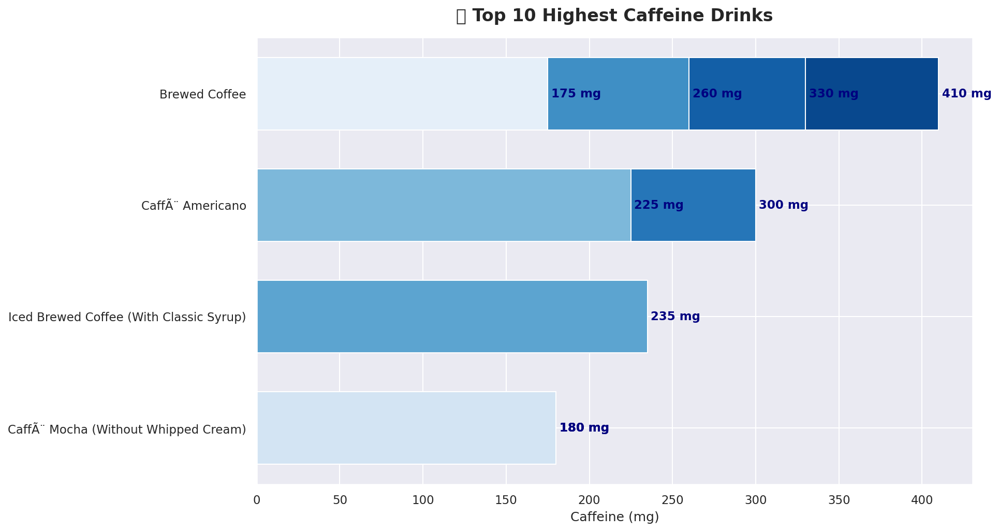
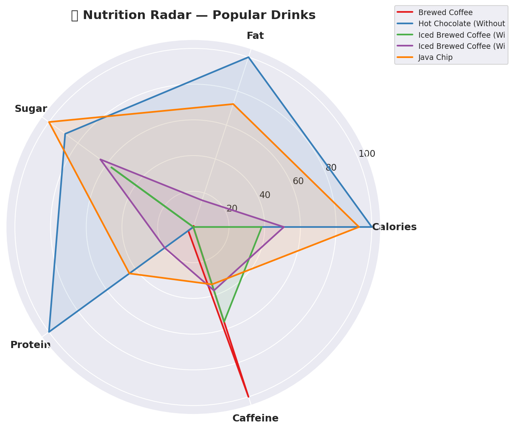
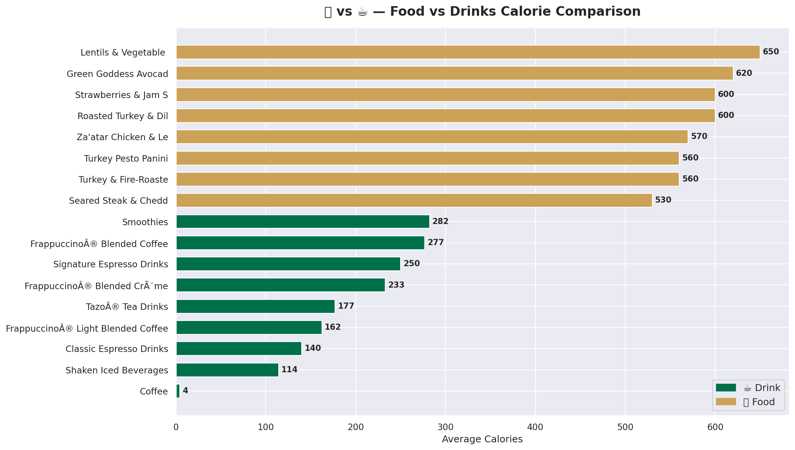
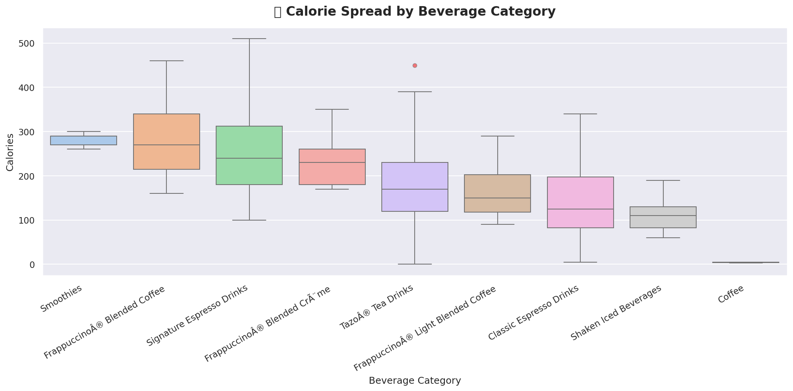

#  Starbucks Nutrition Dashboard

> A creative Data Science project analyzing the complete Starbucks menu using Python — uncovering surprising nutrition insights from 3 real datasets.


---

##  Project Overview

This project performs a full exploratory data analysis (EDA) on the Starbucks menu — covering drinks and food items. Using 3 real Kaggle datasets, we built 7 visualizations to uncover calorie patterns, sugar content, caffeine levels, and a surprising food vs drinks comparison.

**Course:** Data Science with Python  
**Institution:** Lovely Professional University  

---

##  Key Findings

| Insight | Finding |
|---------|---------|
|  Most calorie drink | White Chocolate Mocha — **510 cal** |
|  Least calorie drink | Tazo Tea — **0 cal** |
|  Highest caffeine | Brewed Coffee — **410 mg** |
|  Sweetest drink | Java Chip — **84g sugar** |
|  Avg drink calories | **193.9 cal** |
|  Avg food calories | **356.6 cal** |
|  Highest cal category | **Smoothies** |

>  Surprising fact: Starbucks food has nearly **double** the calories of their drinks!

---

##  Visualizations

### 1.  Top 10 Highest Calorie Drinks


### 2.  Average Calories by Beverage Category


### 3.  Sugar vs Calories Scatter Plot


### 4.  Top 10 Highest Caffeine Drinks


### 5.  Nutrition Radar Chart


### 6.  Food vs Drinks Calorie Comparison


### 7.  Calorie Distribution Boxplot


---

## Datasets Used

| File | Description | Rows |
|------|-------------|------|
| `starbucks-menu-nutrition-drinks.csv` | Basic drink nutrition | 177 |
| `starbucks-menu-nutrition-food.csv` | Food menu nutrition | 114 |
| `starbucks_drinkMenu_expanded.csv` | Full drink details | 242 |

**Source:** [Kaggle — Starbucks Menu](https://www.kaggle.com/datasets/starbucks/starbucks-menu)

---

##  Tech Stack

- **Python 3** — core language
- **Pandas** — data loading & cleaning
- **Matplotlib** — bar charts, scatter plots, boxplots
- **Seaborn** — styled visualizations
- **Google Colab** — development environment

---

##  How to Run

1. Clone this repository
```bash
   git clone https://github.com/nevarbiju126/starbucks-nutrition-dashboard.git
```
2. Open `starbucks_dashboard.ipynb` in [Google Colab](https://colab.research.google.com)
3. Upload the 3 CSV dataset files
4. Click `Runtime → Run All`

---

##  Repository Structure

```
starbucks-nutrition-dashboard/
│
├── starbucks_dashboard.ipynb          # Main Colab notebook
├── starbucks-menu-nutrition-drinks.csv
├── starbucks-menu-nutrition-food.csv
├── starbucks_drinkMenu_expanded.csv
│
├── viz1_top10_calories.png
├── viz2_category_avg.png
├── viz3_sugar_scatter.png
├── viz4_caffeine.png
├── viz5_radar.png
├── viz6_food_vs_drinks.png
└── viz7_boxplot.png
```

---

##  Author

**Neva**  
Department of Mathematics and Statistics  
Lovely Professional University  

[](www.linkedin.com/in/neva-r-biju-2a0b4839b)

---

⭐ If you found this project useful, please give it a star!
